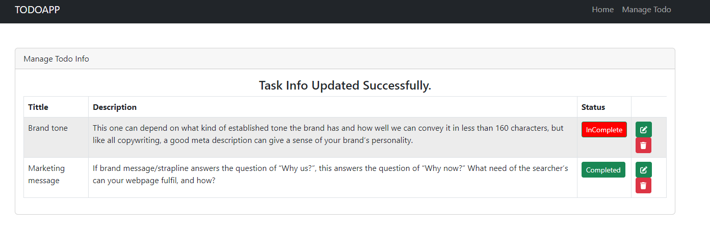
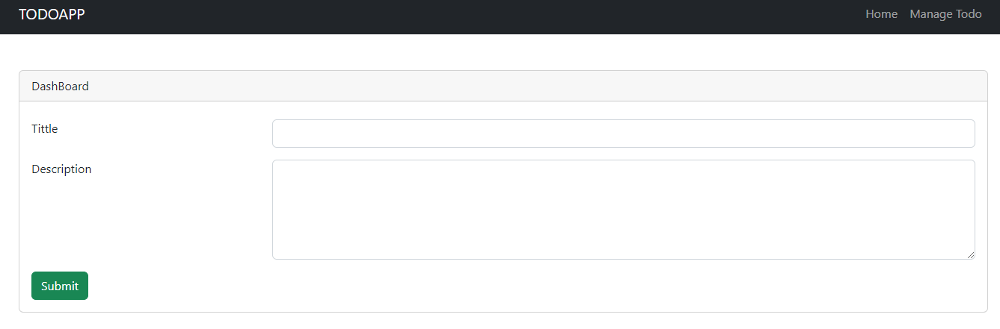
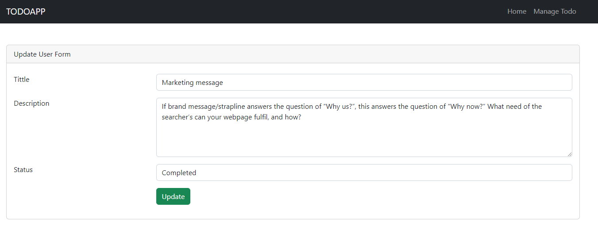

```md
# To-Do List Application

This is a simple to-do list application built using Laravel.

## Features

- Create, read, update, and delete tasks.
- Mark tasks as completed or incomplete.
- Display a list of all tasks with their titles and statuses.

## Requirements

- PHP (>=7.3)
- Composer
- SQLite(Database)

## Installation

1. Clone the repository:
   ```sh
   git clone https://github.com/username/todolist.git
   cd todo-list
   ```


2. Create and configure the `.env` file:
   ```sh
   cp .env.example .env
   ```

3. Set up the database:
   ```sh
   touch database/database.sqlite
   ```

4. Update the `.env` file to use SQLite:
   ```env
   DB_CONNECTION=sqlite
   DB_DATABASE=/path_to_your_database/database.sqlite
   ```

5. Run migrations:
   ```sh
   php artisan migrate
   ```

6. Serve the application:
   ```sh
   php artisan serve
   ```

## Usage

- Access the application at `http://127.0.0.1:8000/tasks`.
- Create, edit, delete, and toggle the completion status of tasks.

### Screenshots

#### Task List



#### Create Task



#### Edit Task



## Authors

- [@shaoun18](https://www.github.com/shaoun18)

